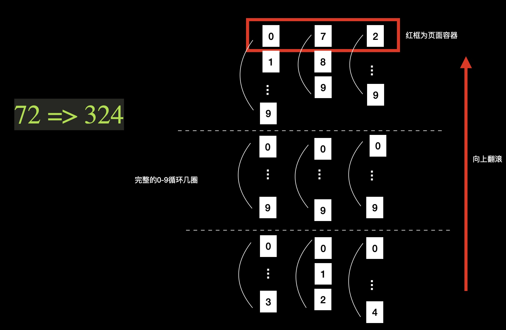

# 前言

大家好，我是飞叶，今天给大家带来一个数字翻滚动画的实现。

## 数字翻滚动画实现

大家在可视化大屏上或者年会抽奖上，都见到过这种数字翻滚动画。

可以先给大家看看demo效果。

[地址](https://flyleaf.netlify.app/)
左侧菜单，第二个AniNumber就是数字翻滚组件。

那么如何实现它呢？我搜了一下，发现大家的实现方式还挺多的，但是有一个明显的技术卡点是如何
让动画停在指定的数字上。

有的实现方式让数字先疯狂转起来，然后动画突然停住后切换到指定数字显示，利用视觉反应没那么快的原理，让大家觉得
动画是平滑的，但是这种方案明显不行，一个是如果要求不让数字转那么快就不行了，第二个是设计师们都是火眼金睛，
不要假想他们发现不了这一点。

还有的实现方式是在动画停住后，做一个回弹效果，总之也是为了避开让动画停在指定数字上的技术卡点。

关于这两种实现方案，大家真正在做此类需求的时候，百度搜一下，就能找到。

我认为这样的方式不够完美，所以思考了一下，自己实现了一把。
我这里画了一张图来解释原理。

;

假如我们要从数字72翻滚到数字324。

第一件事是检查起始数字和目标数字的位数是否相同。如果不同，则对初始数位补0；
（我这里的实现是假设数字一直是向上增的，所以肯定是起始数字位数不够）。

第二，我们要把每个数位的动画分开。其实他们是独立的1个动画，重复了3次而已。

接下来是最重要的，如何进行动画实现呢？

每个数位下其实都是一个数组，数组里已经计算好了所有要进行动画的数字。

比如拿中间的十位举例，起始数字是7，目标数字是2。
那这一数位的数组就是 【7，8，9，0 ... 9，0 ... 9，0，1，2】。
当然至于中间要循环几遍0-9，你自己决定。

当你把数组准备好了，真正执行动画的部分就非常简单了。如下：

```javascript
@keyframes up{
        0%{
          transform: translateY(0);
        }
        100%{
          transform: translateY(var(--translate));
        }
      }
```

然后应用动画即可：
```javascript
.ani{
      animation-name: up;
      animation-timing-function: ease-in-out;
      animation-iteration-count: 1;
      animation-duration: var(--duration);
      animation-fill-mode: both;
      animation-delay: var(--delay);
    }
```
## 如何用这个组件

我知道大家不一定想自己实现一遍，所以我将其封装了组件。
大家可以直接使用。

安装 
```javascript
npm i flyleaf
```
使用
```javascript
import { AniNumber } from 'flyleaf';
const div = new AniNumber({
  target: document.getElementById('app'),
  props: {
    startNum: 182, // 开始数字
    targetNum: 200, // 要滚动到的目标数字
    duration: 3, // 单位是秒
    direction: 'up', // up、down
    isStart: true, // 是否立即开始动画
    circleNum: 2, // 0-9要循环几圈，也是一种控制速度/动画时间的方式
  }
})
```
非常的简单！

## 最后

最后，我也录了一个[视频](https://www.bilibili.com/video/BV1yg41187M6/)来讲这个动画，放在B站了，可以去看。
也欢迎关注我。

