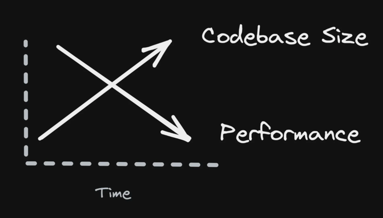

> 原文链接 https://www.builder.io/blog/dont-blame-the-developer-for-what-the-frameworks-did

# 不要因bundle size太大责备开发者

让我们谈谈我们构建 Web 应用程序所必须使用的工具，以及这些工具如何欺骗我们。

## 开发者们共同的故事
你要创建一个新项目，此时，你信心满满这个新站点会很快很流畅。
在一开始，事情看起来确实如此，但是很快你的应用就变大了变复杂了，应用的开启性能变慢了。
在不知不觉中，您手头上有一个巨大的应用程序，而您却无能为力地修复它。你哪里做错了？

我们用的每个工具/框架都承诺提供更好、更快的结果，
但我们通过访问整个互联网里的应用就知道，结果绝不是一个更好、更快的站点。
谁应该为此负责？开发者吗？

作为开发者，你是否有被告知："就是你们搞砸了，你们偷工减料，才导致了一个性能差的站点。"

## 这不是你的错

如果一些网站速度较慢，而另一些网站速度较快，那么当然，责备开发人员可能是有道理的。
但真实情况是：所有网站都很慢！
当没有人成功时，你怎么能责怪开发者呢？问题是系统性的。也许这不是开发者的错。

这是一个关于我们如何构建应用程序、我们使用的工具、工具做出的承诺以及我们最终遇到的缓慢站点的故事。

只有一个结论。这些工具都过度承诺了，这是整个行业的系统性问题。这不仅仅是几个坏苹果，而是整个万维网。

## 代码太多了

我们都知道问题是什么：代码太多！我们非常擅长创建代码，浏览器无法跟上我们的脚步。
每个人都告诉你你的网站有太多的 JavaScript，但没有人知道如何缩小它。

这就像一个 YouTube 健身频道告诉你减肥所需要做的就是少摄入卡路里。
简单的建议，但成功率令人沮丧。
原因是该建议忽略了食欲。
当你又饿又虚弱并且只想到食物时，又有几个人能做到 减少卡路里摄入的意愿呢？
所以也许减肥成功的秘诀可能不是减少卡路里，而是如何控制你的食欲。

这个例子很类似于 JavaScript 膨胀的情况。
我们知道我们需要更少的 JavaScript，
但是我们有太多需求，除了代码要写，还有太多工具和轮子要用，（才能满足需求）
但是所有这些 代码 和工具 都会源源不断地使我们的应用越来越大。

## 打包的演变历史

让我们先看看我们是如何陷入这种境地的，然后再讨论前进的道路。

#### 第 0 代：串联
在 ECMAScript 模块之前，什么都没有，只是文件。
打包过程很简单。这些文件被连接在一起并包装在 IIFE 中。

好处是很难向您的应用程序添加更多代码，因此bundle size保持较小。

#### 第 1 代：打包器
ECMAScript 模块来了。
打包器也出现了：WebPack、Rollup 等。

然而，npm install 一个依赖并把它打包进去有点太容易了。很快，bundle size就成了一个问题。

庆幸的是，这些打包器知道如何进行tree shaking和死代码消除。这些功能确保只有用到的的代码才被打包。

#### 第 2 代：延迟加载
意识到bundle size过大的问题， 打包器开始提供延迟加载。
延迟加载很棒，因为它允许将代码分解成许多chunks并根据需要交付给浏览器。
这很棒，因为它允许从最需要的部分开始 分批交付应用程序。

问题在于，在实践中，我们是使用框架来构建应用程序的，而框架对打包程序如何将我们的代码分解为延迟加载的块有很大影响。
问题在于延迟加载块需要引入异步API调用。
如果框架需要对您的代码进行同步引用，则打包器不能引入延迟加载的块。

所以我们需要明白，虽然打包器声称他们可以延迟加载代码，而且这也是真的，
但想做到延迟加载有个前提条件，即我们使用的框架得让开发者使用promise（来懒加载chunk），否则您可能没有太多选择。 

#### 第 3 代：延迟加载不在渲染树中的组件

框架迅速争先恐后地利用打包器的延迟加载功能，如今几乎所有人都知道如何进行延迟加载。
但是有一个很大的警告！框架只能延迟加载不在当前渲染树中的组件。 

什么是渲染树？它是构成当前页面的一组组件。
应用程序通常具有比当前页面上更多的组件。
通常，渲染树包含视图（这是您当前在浏览器视口中看到的内容）内组件。
和一部分视图之外的组件。

假设一个组件在渲染树中。在这种情况下，框架必须下载组件，因为框架需要重建组件的渲染树，（这是hydration的一部分工作）。
框架只能延迟加载当前不在渲染树中的组件。

另一点是框架可以延迟加载组件，但总是包含行为。
因为组件包含了行为，这个懒加载的单位就太大了。如果可以延迟加载的单位更小会更好。
渲染组件不应要求下载组件的事件处理程序。
框架应该只在用户交互时才下载事件处理程序，而不是作为组件渲染方法的一部分。根
据您正在构建的应用程序的类型，事件处理程序可能代表您的大部分代码。
所以耦合组件的渲染和行为的下载是次优的。

## 问题的核心
仅在需要重新渲染组件时才延迟加载组件渲染函数，并且仅在用户与事件处理程序交互时才延迟加载事件处理程序。
这样才是最好的！
默认应该是所有内容都是延迟加载的。

但这种方法存在一个大问题。问题是框架需要协调其内部状态与 DOM。
这意味着至少需要一次hydration，来进行完整渲染以重建框架的内部状态。
在第一次渲染之后，框架可以对其更新进行更准确的把控，但问题已经产生了，因为代码已经下载了。所以我们有两个问题：

* 框架需要下载并执行组件以在启动时重建渲染树。（请参阅hydration 是纯粹的开销）这会强制下载和执行渲染树中的所有组件。
* 事件处理程序随组件一起提供，即使在渲染时不需要它们。包含事件处理程序会强制下载不必要的代码。

因此，当今框架的现状是，必须急切地下载和执行 SSR/SSG 渲染树中的每个组件（及其处理程序）。
使用当今的框架进行延迟加载有点说谎，因为您并不能在初始页面呈现时进行延迟加载。

值得指出的是，即使开发人员将延迟加载边界引入 SSR/SSG 初始页面，也无济于事。
框架仍需下载并执行 SSR/SSG 响应中的所有组件；因此，只要组件在渲染树中，框架就必须急切地加载开发人员试图延迟加载的组件。

渲染树中组件的急切下载是问题的核心，开发人员对此无能为力。
尽管如此，这并不能阻止开发人员因网站运行缓慢而受到指责。

## 下一代：细粒度的延迟加载

那么，我们该何去何从？显而易见的答案是我们需要更细粒度。该解决方案既明显又难以实施。我们需要：

* 更改框架，这样它们就不会在hydration阶段急切地加载渲染树。
* 允许组件渲染函数 独立于组件事件处理程序 单独下载。

如果您的框架可以完成上述两个部分，那么用户将看到巨大的好处。
应用程序的启动要求很少，因为启动时不需要进行渲染（内容已经在 SSR/SSG 处渲染）。
下载的代码更少：当框架确定需要重新渲染特定组件时，框架可以通过下载渲染函数来实现，而无需下载所有事件处理程序。

细粒度的延迟加载将是网站启动性能的巨大胜利。
它要快得多，因为下载的代码量将与用户交互性成正比，而不是与初始渲染树的复杂性成正比。
您的网站会变得更快，不是因为我们更擅长使代码更小，而是因为我们更擅长只下载我们需要的东西，而不是预先下载所有东西。

## 入口点 entry point

拥有一个可以进行细粒度延迟加载的框架是不够的。
因为，要利用细粒度的延迟加载，您必须首先拥有要延迟加载的bundles。

为了让打包器创建延迟加载的chunk，打包器需要每个块的入口点。
如果您的应用程序只有单个入口点，则打包器无法创建多个chunks。
如果您的应用程序只有单个入口点，即使你的框架可以进行细粒度的延迟加载，它也没有什么可以延迟加载的。

现在创建入口点很麻烦，因为它需要开发人员编写额外的代码。
在开发应用程序时，我们真的只能考虑一件事，那就是写功能。
让开发人员同时考虑他们正在构建的功能和延迟加载对开发人员来说是不公平的。
所以在实践中，为打包器创建入口点很麻烦。

所需要的是一个无需开发人员考虑就可以创建入口点的框架。
为打包程序创建入口点是框架的责任，而不是开发人员的责任。
开发人员的职责是构建功能。
该框架的职责是考虑应该如何完成该功能的底层实现。
如果框架不这样做，那么它就不能完全满足开发人员的需求。

## 担心切入点太多？
目标应该是创建尽可能多的入口点。
但是，有些人可能会问，这是不是就会导致下载很多小块而不是几个大块吗？答案是响亮的“不”。

如果没有入口点，打包器就无法创建chunk。
但是打包器可以将多个入口点放入一个chunk中。
您拥有的入口点越多，您以最佳方式组装bundle的自由度就越大。
入口点给了你优化bundle的自由。所以它们越多越好。

## 未来的框架
下一代框架将需要解决这些问题：

* 拥有人们喜欢的开发体验DX。
* 对代码进行细粒度的延迟加载。
* 自动生成大量入口点以支持细粒度的延迟加载。

开发人员将像现在一样构建他们的网站，但这些网站不会在应用程序启动时用下载和执行一个很大的bundle来压倒浏览器。

Qwik是一个在设计时考虑到这些原则的框架。Qwik细粒度延迟加载是针对每个事件处理程序、渲染函数和effect的。

## 结论

我们的网站越来越大，看不到尽头。
它们之所以大，是因为这些网站今天比以前做得更多——更多的功能、动画等。并且这种趋势将继续下去。

上述问题的解决方案是对代码进行细粒度的延迟加载，这样浏览器就不会在初始页面加载时不堪重负。

我们的打包工具支持细粒度的延迟加载，但我们的框架不支持。
框架hydration强制渲染树中的所有组件在hydration时加载。（目前的SSR框架唯一的延迟加载是 当前不在渲染树中的组件。）
即使事件处理程序可能是代码的大部分，并且hydration并不需要事件处理器代码，现在的SSR框架还是随组件的下载一并下载了事件处理程序.

因为打包器可以细粒度的延迟加载，但我们的框架不能，我们无法识别其中的微妙之处。
导致的结果就是我们将网站启动缓慢归咎于开发人员，
因为我们错误地认为他们本可以采取一些措施来防止这种情况发生，尽管现实是他们在这件事上几乎没有发言权。

我们需要将细粒度延迟加载设计为框架核心功能的新型框架（例如Qwik ）。
我们不能指望开发者承担这个责任；他们已经被各种功能淹没了。
框架需要考虑延迟加载运行时以及创建入口点，以便打包程序可以创建块以进行延迟加载。
下一代框架带来的好处将超过迁移到它们所花费的成本。

