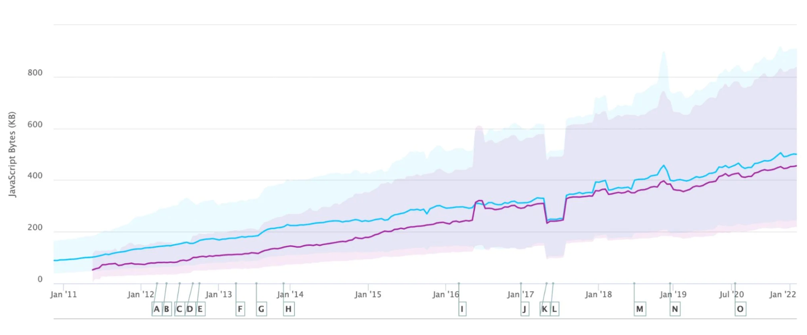
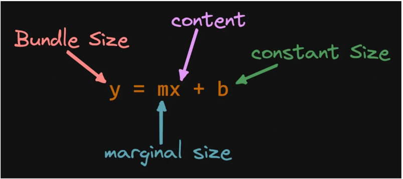
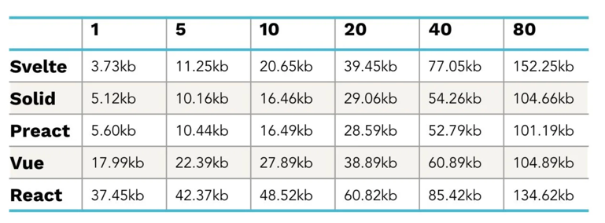
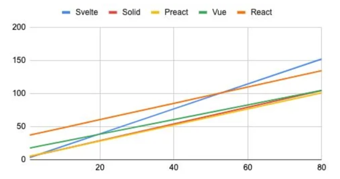
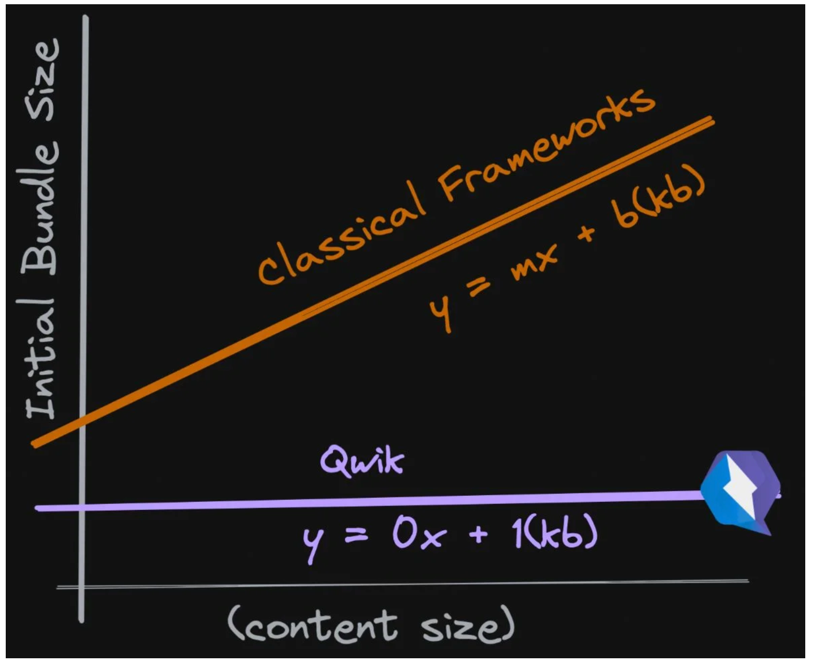
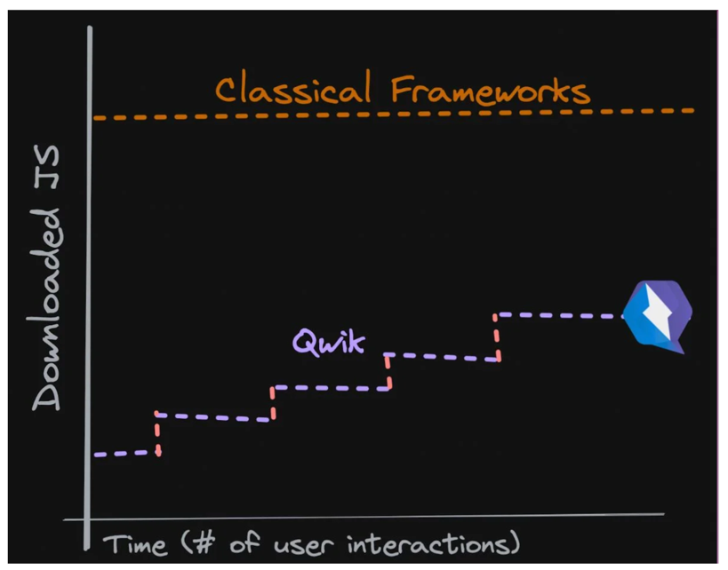
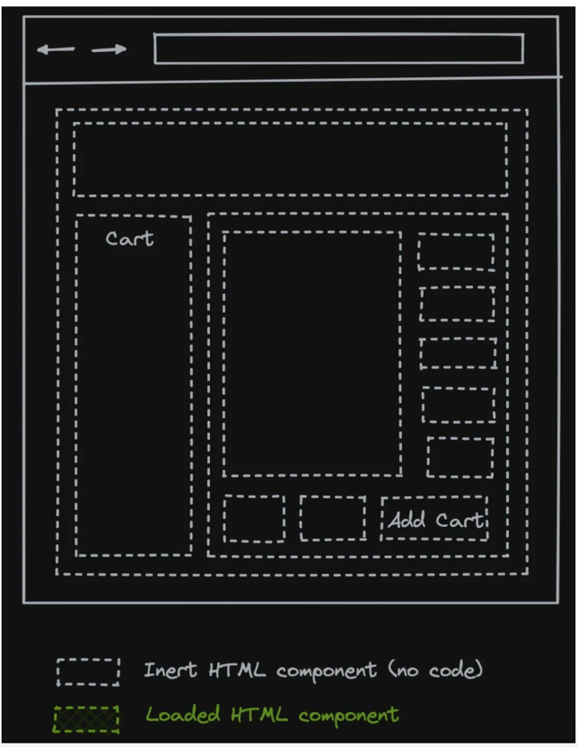
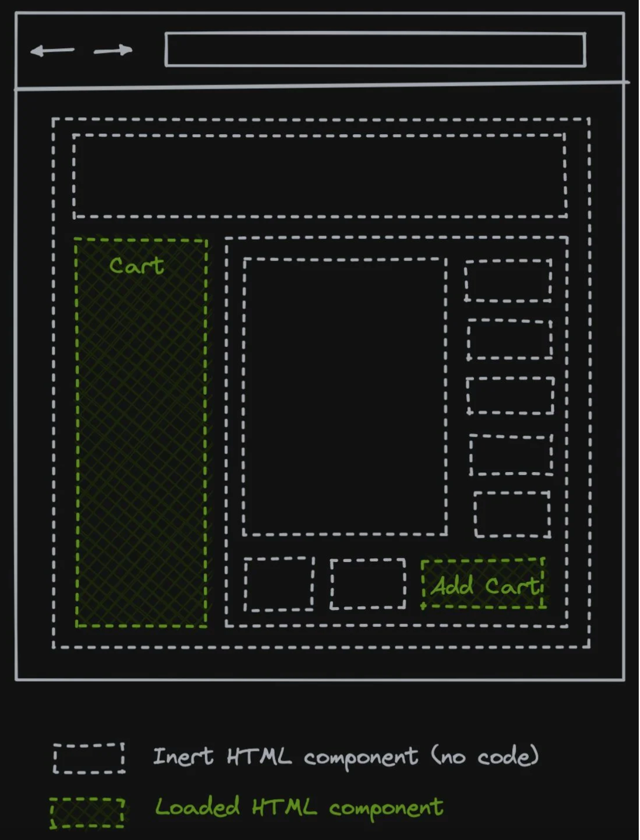

> 原文链接 https://www.builder.io/blog/our-current-frameworks-are-on-we-need-o1

# 当前框架是O(n)，但我们需要O(1)

今天，网站比以往任何时候都更具交互性和实用性，这也意味着它们比以往任何时候都更加复杂。
用户甚至还在期待新的交互性和实用性。
所有这一切都意味着在页面加载时向浏览器发送的 JavaScript 比以往任何时候都多，这是趋势。
我们可以期待网站会继续变得更好和更复杂，但是我们应该如何处理 JavaScript 呢？

# 我们是怎么走到这一步的？

众所周知，发送到浏览器的 JavaScript 数量正在稳步增加，如httparchive.org的这张图表所示。

有些人喜欢抬杠说，十年前网站和我们今天的网站是一样的，没什么区别啊。
实际上，今天的网站要复杂得多。

有一些复杂性来自于为最终用户提供更好的交互和功能，还有很大一部分复杂性来自于帮助我们深入了解用户的行为，从而帮助我们构建更好的网站。
我们的网站最终会变得更大，因为它们不仅为我们的用户，也为我们自己做了更多的事情。 

# CPU 性能提升已封顶。
每年，CPU 都在变得越来越快，但大部分加速都来自改进的并行性。
近年来，每个核心的性能提升一直在放缓。
我们正在接近 CPU 时钟的运行速度以及每个时钟周期 CPU 的智能程度的极限。
结果，我们看到更多的多核 CPU 出现（您的手机拥有 4 个 CPU 内核和 4 个 GPU 内核并不少见）。
因此，如今 CPU 性能提升的主要驱动力来自多核的并行性，而不是单核的改进。

那么，我们为什么要谈论 CPU 速度和内核呢？
随着我们的网站变得越来越大并下载更多的 JavaScript，CPU 有更多的工作要做。
而且由于 JavaScript 是单线程的，所有额外的工作都落在了一个内核上。
因此，这不是一个等待几年并期望硬件赶上来会变得更好的问题。

最终，我们当前的 JS 负载增长速度超过了单 CPU 核心性能的速度。这是不可持续的。

# 框架不是为此而设计的。
桌面应用程序的框架在 Web 之前就已经存在。
因此，当网络出现时，我们只是将桌面框架理念，应用到Web上。
桌面框架可以安全地假设所有代码都已经可用并且没有服务器。
问题是这两个关键点对于Web来说是不正确的。
我们不能假设代码已经可用，服务器预渲染已经成为我们词汇的重要组成部分。

我们正处于我们拥有的框架假装它们是桌面框架的阶段。
他们还没有将 SSR 和延迟加载纳入核心。

# y=mx+b

应用程序需要在客户端上启动。
启动包括框架的固定成本和应用程序本身的可变成本（应用程序的复杂性）。
所以实际上，我们谈论的是一种线性关系，可以表示为“y=mx+b”。

当框架争论谁更小时，它们实际上只能在两点上竞争：框架的固定成本或应用程序的可变成本。所以要么较小的“m”或较小的“b”。

Ryan Carniato 在他的文章JavaScript 框架 TodoMVC 大小比较中对不同框架进行了很好的比较（表复制如下）。

为了我的论点，确切的数字并不重要，但该表很好地说明了随着应用程序大小的增加，不同的框架如何具有不同的斜率（“m”）和不同的初始值（“b” ）。

 

# 即使是最小的“m”也不够。

问题是所有框架都具有大致相同的斜率。
即使框架完全编译掉，所以它的“b”变为零，应用程序也会控制下载和执行大小。
对于足够大的应用程序，“b”类无关紧要。

以上所有行都是“O(n)”。
随着应用程序变大，初始包的大小也会变大。
随着我们继续构建更好的最终用户体验，应用程序将继续变得更大。 

# 新目标O(1)

我们需要的是一个新的范式。
无论应用程序的复杂性如何，我们都需要一个具有恒定加载时间的框架。
乍一看，这听起来不可能——当然，因为初始bundle与应用程序的复杂性成正比。
但是如果我们延迟加载代码而不是急切地做呢？
我在我的帖子中介绍了为什么现有框架需要急切地下载代码，Hydration is pure overhead 。
这是我们正在寻找的东西：

当前的现状是一次下载并执行所有代码。但我们所需要的是一种在用户与站点交互时再下载 JavaScript 的方法。
没有交互，没有 JavaScript；很少的交互，很少的 JavaScript。
如果有很多交互，我们会接近经典框架并下载大部分代码。
但重要的是，我们需要将我们的思维模式从一开始急切地下载代码转变为在用户交互时懒惰地下载代码。

当前的框架在某种程度上已经知道如何做到这一点，因为他们都知道如何在路由更改时下载更多代码。
需要将该范式扩展到交互级别。

在上图中，站点以 HTML 格式交付给客户端。
请注意，没有一个组件加载了相应的代码。下图显示了需要在用户交互时下载和执行哪些组件。
结果是需要下载的代码要少得多，而下载的代码稍后会执行。
这减轻了 客户端CPU 在站点启动时必须执行的工作量。

# 总结
我们下载到浏览器的 JavaScript 数量每年都在增加。
问题是我们的网站的复杂性随着我们提供需要更多代码的更复杂的最终用户体验而增加。
我们已经达到了初始下载代码过多的地步，并且我们网站的启动性能受到影响。
这是因为我们使用的框架是 O(n)。这是不可扩展的。

虽然不同的框架最终有不同的坡度，但任何坡度都太大了。
相反，我们需要延迟加载交互而不是初始加载。框架已经知道如何在路由更改时延迟加载，我们只需要更深入并在交互上也这样做。
这是必要的，以便我们的初始加载大小可以是 O(1)，并且我们可以根据需要延迟加载代码。
这是我们在未来继续构建更复杂的 Web 应用程序的唯一方法。

