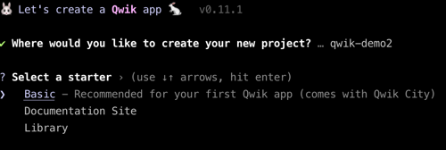
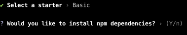
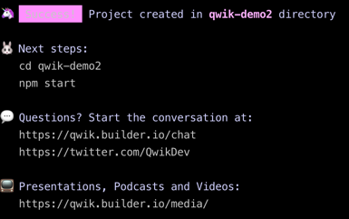
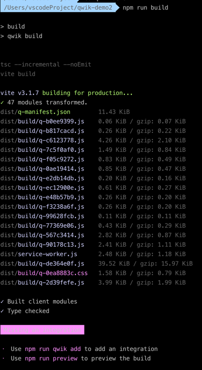
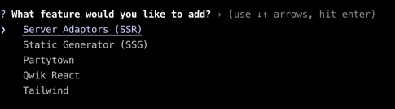
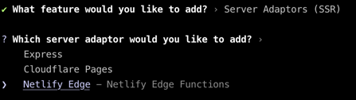
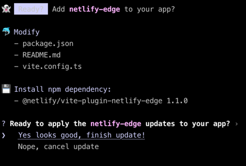

# 如何部署Qwik应用到netlify?

## 创建一个Qwik应用

```javascript
npm create qwik@latest
```
填项目名字：qwik-demo2

选择base


安装依赖: y


qwik应用初始化完毕!


可以进入该项目目录，npm start跑一下看看！
```javascript
cd qwik-demo2
npm start
```

## build应用

```javascript
npm run build
```



build完成后，你会发现下面多了两条命令，我们要关心的是其中的第一个：npm run qwik add

## 添加netlify配置

```javascript
npm run qwik add
```

我们选第一个SSR。


然后再选第三个:netlify edge


再往下执行，会看到：


选了yes look good后，跟netlify的整合就完成了。

## 去git新建一个仓库，把这个项目推到仓库里。

这一步大家都比较熟悉了，就不一步步写步骤了，不懂的话可以看B站的视频演示。

## 去netlify网站配置

[netlify网址](https://app.netlify.com/start)

主要有下面四步骤：

* 登陆netlify账号(建议选GitHub授权登陆)

* 选github里面的qwik-demo2项目

* 开始构建

* 可以访问了！

## 验证一下是不是SSR服务