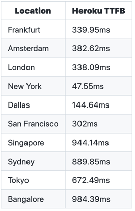
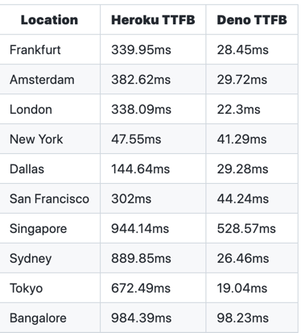
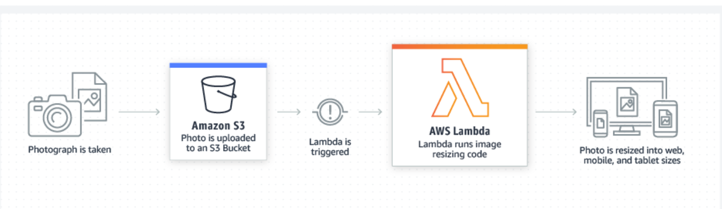

# web的未来是边缘计算

在最开始，在瑞士的一张桌子上有一台计算机，上面有一句红色文案：这是一台不会关闭的机器。

 

32年后，这个世界上有成千上万种那样的机器。也都永不关闭。

但是开发一个web好像还是只需要一个机器。我们开发代码，然后部署在一个server上，不管这个
server是位于哪里的数据中心，加利福尼亚、弗吉尼亚、瑞士都行。

但也不是非要这样。很多年了，静态资源都是通过CDN提供服务的。现在，动态web应用也可以这样了。
你可以把一个动态web应用部署在任何地方。

# 什么是边缘计算？

当人们说边缘计算，他们的意思的你的站点或者应用是同时部署在全球多个服务器上的，这样就能保整应用距离用户总是是近的。
当有用户请求站点或应用时，请求会被定向到(地理上)距离用户最近的那台服务器上。
这些分布的服务器不仅可以提供静态资源服务，也可以提供动态web应用服务。

把服务器部署在距离用户更近的地方是优化延迟的一种物理方式。
这意味着每一个页面加载都只需要更少的延迟。
页面加载的时间越长，用户越可以流失。
根据Google的研究，在页面加载时间从1秒变为3秒后，有32%的用户流失。
而从1秒到5秒，有90%的流失率。
当页面加载时间只有2秒时，用户会浏览9个页面；但当页面加载时间为7秒时，用户只浏览3个页面。

当然这只是一个粗略的数据，不必过于纠结更精确的数值。

你开发了一款应用，它很酷，做了一些有意思的事情。
你想把它展示给全世界，所以你得部署它。
比如你喜欢使用Heroku（一个云服务平台）。
你可以把代码推到heroku，然后在浏览器输入myfunapp.com去访问它。

默认情况下，Heroku的服务器都在位于northern Virginia的AWS数据中心。
对一些人来说，这棒极了。比如当你的居住地离这个地方很近时，你的访问速度非常快。
但是并不是所有人都很幸运地居住在距离数据中心很近的地方。

所以就让我们来看看一个部署在Virginia的应用在不同的地理位置访问的访问时间：
（注意这里用的指标是（TTFB）time to first byte, 即服务器响应回来的第一个字节数据）



正如别人所说，如果用户是在Frankfurt（德国城市），情况一般。
因为每个请求必须从Frankfurt经过美国，然后再返回来。
如果是更远的用户，将会等待更久。


如果你在世界的另一边，基本上要花费1秒钟才能从服务器取回第一个字节，那就更别说整个页面的数据了。
对于Bangalore or Sydney用户来说，任何一个页面的访问都是一个糟糕的体验。
（坦白讲，实际上处理美国东部用户外，其他地方的访问都很糟糕）
作为老板，你会损失pv, 损失用户，损失钱。

让我们重新看看deno.com的速度，它部署在我们的边缘计算网络里，Deno Deploy。



除了新加坡，全世界范围的范围我们的第一个字节都可以在小于100毫秒内返回。
这是因为你并不需要去Virginia取站点数据，每一个位置的用户都有自己对应的最近的边缘服务器。
你可以用VPN测试一下，比如：

```javascript
curl -I https://deno.land
```
你会得到一个距离你最近的服务器位置：

```javascript
server: deno/us-east4-a

```
假如用VPN把请求代理到日本，会得到下面这个服务器位置：
```javascript
server: deno/asia-northeast1-a

```

假如代理到爱尔兰：
```javascript
server: deno/europe-west2-a

```

假如代理到澳大利亚悉尼：
```javascript
server: deno/australia-southeast1-b

```
每一次请求都会得到最佳选项。

中心化服务器模型已经 运行了很多年，并将继续为一些应用提供服务。
但是web的规模和web的未来是跟这个模型相反的。
让我们来看看这个架构模式是怎么来的，以及为什么要改变它。


服务器是1969年Network Working Group的RFC里提出的概念。
Tim Berners-Lee办公室里的NeXT机器是第一个web server。
但是这个时候，internet的概念已经存在20年了。


The ‘69 RFC laid out the foundation for 
how to transmit and receive data between a “server-host” and a user on ARPANET, 
the OG military-funded internet that initially connected four universities in the western US. 
The server was up and running by 1971 and a paper titled “A Server Host System on the ARPANET” published in 1977 by Robert Braden at UCLA (one of the connections on ARPANET) went into the details of that initial setup:

> This paper describes the design of host software extensions which allow a large-scale machine running a widely-used operating system to provide service to the ARPANET. This software has enabled the host, an IBM 360/91 at UCLA, to provide production computing services to ARPANET users since 1971.

This is the first internet server: an IBM 360/91. 
The hardware and software have changed, and you no longer roll your own, 
but fundamentally this is still how the internet works today: servers providing a service.

# 为附近用户缓存内容

这个架构工作了很长一段时间。
但是在接近2000年的时候，web开始变得非常庞大，裂痕出现。

基本上，服务器因受欢迎程度过多而崩溃，或者来自 90 年代黑客的早期 DDoS 攻击。
第一个是Akamai，他们在98年建立了第一个CDN， 叫做“hot spots.”。

Akamai’s CDN通过分布式系统缓存内容。请求会被路由到距离用户最近的服务器。
但是，只有静态资源会被缓存：html/css/img/video等。
任何动态的内容还是不得不去核心服务器处处理。

CDNs逐渐成为现代web的核心套件，大部分静态文件都缓存在那里。
第一次你请求一个站点，可能需要从源站拉取HTML/css/img，但是cdn会缓存这些文件到距离你最近的服务器节点。
所以你还有跟你居住在同一个区域的人，后续都会访问到缓存的内容。

# Less servers, more serverless

服务器也存在与服务过载相反的问题：效用不足。
像 Tim Berners-Lee 的机器这样无法“断电”的服务器，必须 100% 的时间都处于启动状态。
即使您的应用程序每天获得 10 秒的访问，您仍然需要为其他 86,390 秒付费。

Serverless缓解了这个问题。
它们可以随意断电。 
“Serverless”是用词不当——仍然涉及服务器。
但是您没有始终处于运行状态的专用服务器。相反，服务器是事件驱动的，只有在发出请求时才会激活。

尽管有更早的版本，但 AWS Lambda 是第一个得到广泛使用的serverless框架。

 

无服务器的好处有两个：

1. 你只需为你使用的东西付费，如果这就是你的应用程序只有10秒有人访问，只需要为这10秒付费。
2. 您不必担心服务器的所有 DevOps 方面。无需规划、无需管理、无需维护。

缺点主要来自性能。
无服务器功能存在“冷启动”问题，每次都必须配置资源，从而增加延迟。
而且，serverless 的服务器仍然是中心化的，所以你仍然需要很长的往返时间。

所以我们来到了现在。
服务器没有死，但距离（最新技术）已经很远，可能会倒下； 
CDN 将您的内容缓存在靠近用户的位置，但仅限于静态内容；
serverless意味着更少的 DevOps 和（可能）更低的成本，但冷启动的延迟更高。

# Livin’ on the edge

edge的美妙之处在于它利用了 CDN 的最佳部分（靠近用户）和serverless的最佳部分（运行函数）并将它们结合在一起。


使用边缘，您可以执行靠近用户的自定义代码。这有很多好处。

# 更好的性能

这是您的用户唯一关心的事情。
您的网站是否加载速度快、是否挂起、使用起来是否令人沮丧？
由于站点或应用程序由 用户附近的 边缘服务器提供服务，因此它会比在集中式服务器上更快。


但性能优势并不止于此。由于计算是在edge执行的，而不是由用户的浏览器执行：

1. 该应用程序在最终用户的计算机上占用的资源较少，因此 CPU 和内存的使用较少，浏览器挂起的可能性也较小。
2. 更小的数据量被发送给最终用户，因此使用的带宽更少。
3. 由于函数在受控环境中运行，因此函数和 API 的行为是一致的。

# 更好的安全性

将计算从客户端设备转移到edge fn还可以减少对您的应用程序的潜在攻击向量。
用 Deno 的 DX 工程主管 Kitson Kelly 的话来说，“这意味着你会立即减少暴露给最终用户的表面积。”他说（为了清楚起见，缩写）：

"您的设备不必对后端服务进行 API 调用。我认为我们所有人都必须对此进行辩护。
而且，如果您将计算从客户端设备上移开，您发送的只是 HTML 和 CSS，那么您已经消除了这个问题。
"

此外，DDoS 攻击难度更大。
任何攻击者都不仅仅要关闭一台服务器，他们需要在全球范围内关闭数十台、数百台甚至数千台服务器。
即使他们成功地使 10 台服务器离线，仍然可能有 20 台可用服务器可以用。

# 更好的开发体验

现在，为边缘编写代码比它需要的要复杂得多。
在很大程度上，这是由于edge开发的混合性质。
大多数实现它的框架都不是edge-first的，
因此开发人员必须选择任何给定的功能或页面是在edge server上服务器端渲染还是在浏览器中渲染。

这使得边缘开发更加复杂。
但是较新的框架，例如 Fresh，默认情况下向客户端提供零 JavaScript，
通过采用服务器端渲染和孤岛架构简化了edge。
将 Fresh 与我们的全球分布式 JavaScript serverless edge网络 Deno Deploy 结合使用的开发人员可以获得edge的好处，
例如获得完美的 Lighthouse 分数

edge是互联网的下一次迭代。
从 IBM 36091 到 Berners-Lee 的 NeXT 机器，
再到 Akamai 的 CDN，再到 Amazon 的数据农场，再到serverless再到edge。
每个阶段都建立在上一个阶段的基础上，吸取教训并纠正错误。
edge是（对用户和开发者来说）使网络更快、更安全的下一个阶段。

立即使用 Fresh 和 Deno Deploy 在几秒钟内部署到全球边缘服务器。